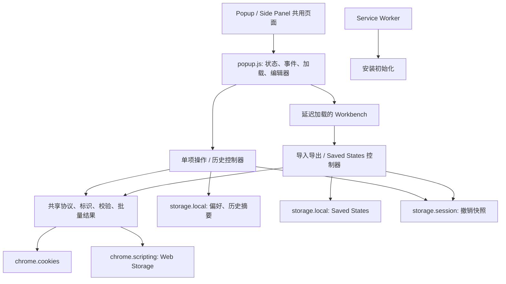

# Cookie Controller 项目评估与后续迭代安排

评估日期：2026-09-10。代码基线：`7107fec`，Manifest 版本：`0.3.1`。

本轮基于源代码、协议与产品文档、发布物料、自动化测试及隔离 mock 复现进行评估，没有修改业务代码。工期为建议，尚未开始执行。商店线上版本、安装量、留存和真实用户反馈没有可核验数据。

后续执行记录：v0.3.2 已完成。目标隔离、历史撤销、Reset、草稿与容量保护已接入，86 项单元测试、静态检查、里程碑检查、完整浏览器验收及 v0.3.2 专项回归均通过。详情见 [v0.3.2 执行记录](release-notes-v0.3.2.md)。下文的问题与验证结果保留为开发前评估记录。

v0.3.3 已完成：统一后台操作 journal、逐项 checkpoint 与中断恢复、失败重试、撤销冲突检查、Operations 结果视图和多界面增量写入协调均已接入。178 项单元测试、静态检查、里程碑检查、完整浏览器验收及 v0.3.2/v0.3.3 专项均通过；真实 action Popup 在任务未完成时关闭并重开、Worker 在写入前后强制停止后恢复已验证。详情与使用边界见 [v0.3.3 执行记录](release-notes-v0.3.3.md)。下一阶段为 v0.3.4 安全与发布。

## 1. 总体评价

项目已经超过 MVP，形成了一个有实际使用价值的开发、测试工具。Cookie 与 Web Storage 管理、JSON/Netscape 数据交换、Saved States、导入预览和撤销组成了明确的工作流，产品方向值得继续投入。

当前主要瓶颈是可靠性和发布工程。单项撤销和 Storage 写入存在目标隔离缺陷，模块拆分已有运行时遗漏，测试通过也不能代表这些边界已被覆盖。建议先交付稳定性版本，再推进状态对比与高级编辑。

| 维度 | 评价 | 依据 |
|---|---|---|
| 产品定位 | 清楚 | 聚焦开发、测试、联调中的登录状态、灰度配置和问题复现 |
| 功能完整性 | 较高 | 三类站点数据、双界面、批量操作、数据包、收藏、历史和配置组均已落地 |
| 架构 | 基础合理，控制层仍偏集中 | 共享协议与纯逻辑边界较好；全局可变 state、回调注入和多条写入管线仍耦合 |
| 交互 | 高频操作可用，状态保护不足 | 主入口直接、操作有分组；编辑草稿、短暂错误提示、配置组维护仍有缺口 |
| 可靠性 | 下一阶段首要短板 | 已复现错误目标写入和撤销；配置组存在静默截断 |
| 测试 | 有基础，发布门禁不足 | 33 项单元测试通过；本次完整浏览器验收未通过，生命周期和导航场景不足 |
| 隐私与信任 | 本地处理方向正确 | 无运行时第三方依赖或分析 SDK；全站权限、明文展示和本地数据管理仍需增强 |
| 发布维护 | 偏弱 | 无统一打包/CI 入口，版本与文案漂移，Git 跟踪依赖目录 |

建议继续使用原生 ES Module。现阶段引入 React、服务端或账号体系不能解决已发现的目标隔离与恢复问题，反而会增加迁移工作量。

## 2. 项目结构与数据流

- 技术栈：Manifest V3、原生 HTML/CSS/JavaScript、ES Module；开发依赖为 Playwright，无编译构建步骤。
- 代码规模：40 个源文件；`popup.js` 约 1,870 行，`popup.css` 约 3,797 行，`popup.html` 约 766 行，`popup-workbench.js` 约 678 行。
- 好的基础：Cookie 标识包含 store、partition、domain、path、name；数据包有版本校验；跨 origin 默认拒绝导入；批量结果区分成功、失败、跳过；动态内容主要通过 DOM API 与 `textContent` 渲染。
- 主要耦合：Popup state 同时参与数据读取、目标选择、编辑、历史和批量写入。单项编辑、快速导入、数据包导入分别组织操作和历史，删除未统一进入可撤销操作记录。
- 执行限制：后台当前只做初始化，长批次实际由界面页面执行。`storage.session` 是会话存储，并不自动使界面内任务在关闭后继续运行。

## 3. 已确认问题

P1 表示应在新增主要功能前处理的数据正确性问题；P2 表示明确的功能、交互或工程缺陷。

### P1：历史撤销可能修改其他站点或标签页

历史列表仅按数据类型过滤。撤销时使用当前 `state.tab.id/url`，没有校验原始 origin 和 tab。

- A 站修改 Local Storage 后切到 B 站，撤销可能将 A 的旧值写到 B。
- 同 origin 的两个标签页拥有不同 Session Storage，当前逻辑仍会写到当前标签页。
- 两种情况都已通过隔离 mock 复现，并出现成功提示。
- 修复：快照记录目标上下文；Storage 按 origin 隔离，Session Storage 同时约束原 tab/文档；Cookie 按 store、domain/path、partition 校验；撤销前检查当前值是否已被后续操作改变。

证据：[历史撤销](D:/code/chrome/cookies-manager/src/popup/popup-history-controller.js:143)、[历史列表过滤](D:/code/chrome/cookies-manager/src/popup/popup-history-view.js:27)。

### P1：Storage 注入没有校验实际文档 origin

`setStorageValue` 校验的是调用方传入的 URL，执行脚本时只指定 tabId。标签页已经导航到其他 origin 时，写入仍发生在新页面，返回结果却继续报告旧 URL 的 origin。删除也有同类缺口。

- 已用模拟注入环境复现“传入 A URL，实际写入 B，返回 origin=A”。
- 修复：为一次操作固定 tabId、预期 origin、cookieStoreId，适用时绑定 documentId；在注入函数内部、写删之前核对真实 origin，并回读实际结果。仅在注入前执行一次 `tabs.get` 不能消除导航竞态。

证据：[Storage API](D:/code/chrome/cookies-manager/src/shared/storage-api.js:18)。

### P1：第 51 个 Saved State 会静默挤掉旧数据

`normalizeSiteProfiles` 默认只保留 50 项。新建和复制将新项目放在数组头部，再把截断结果写回本地存储，导致最旧项无提示消失。

- 已运行纯逻辑复现：输入 51 项，输出 50 项，末项丢失。
- 修复：保存前显式检查容量并给出清理入口；增加按字节的 quota 错误提示，不能以静默丢弃用户保存内容的方式控制容量。

证据：[配置组规范化](D:/code/chrome/cookies-manager/src/shared/site-profiles.js:69)、[配置组写入](D:/code/chrome/cookies-manager/src/shared/site-profile-store.js:12)。

### P2：Reset 存在运行时错误

调用方已经传入 `updateValueWorkspaceHeight`，但 `createPopupItemActionsController` 的参数解构漏接。点击 Reset 修改文本后抛出 `ReferenceError`，后续保存按钮和工具结果更新中断。已用 mock 复现。

修复该参数并增加未定义标识静态检查、控制器交互测试与浏览器 `pageerror` 断言。

证据：[Reset 实现](D:/code/chrome/cookies-manager/src/popup/popup-item-actions-controller.js:241)。

### P2：编辑草稿可能被无提示覆盖

重复点击当前行仍会重绘编辑器，直接把输入框赋回原始值；Cookie 变化监听触发列表刷新，也会走同一重绘流程。

修复：区分服务器/浏览器基线值、编辑草稿和外部新值；同项点击保留草稿；目标或项目切换时处理未保存状态；发生外部更新时提示冲突。此项本轮依据代码路径确认，未单独完成真实浏览器交互复现。

证据：[选择项目](D:/code/chrome/cookies-manager/src/popup/popup.js:1439)、[编辑器赋值](D:/code/chrome/cookies-manager/src/popup/popup.js:1574)。

### P2：Saved State 导出缺少导回闭环

导出格式为 `{profileSchemaVersion: 1, profile}`，导入入口只接受顶层含 `schemaVersion` 的站点数据包。将导出的 Saved State 交给现有解析器会返回 `UNSUPPORTED_SCHEMA_VERSION`，已通过纯逻辑复现。

修复：增加配置组文件识别、版本校验、重复 ID/名称策略和导入预览，保留变量、标签、origin 规则。恢复配置组与应用到站点应是两个明确动作。

证据：[配置组导出](D:/code/chrome/cookies-manager/src/popup/popup-site-data-controller.js:288)、[当前导入路径](D:/code/chrome/cookies-manager/src/popup/popup-workbench.js:303)。

### P2：测试与发布基线需要收敛

- 本次完整验收在 `assertEditorActions` 的 `#closeStatusButton` 点击处超时；错误提示设置为 3 秒自动关闭，执行到点击时已不再可见。需要针对定时反馈设计确定性断言；这次失败不能证明后续流程通过。
- 浏览器脚本没有统一捕获 `pageerror`，运行时错误可能直到后续 UI 断言才被发现。
- `node_modules` 有 175 个文件被 Git 跟踪；`.gitignore` 只包含 `*.zip`。依赖缓存、临时截图和源码边界不清晰。
- 仓库没有统一打包命令和 CI 定义；Manifest 为 0.3.1，本地 `release` 只见 0.3.0 zip。这里只能评价仓库状态，不能据此判断商店版本。
- 中英文商店文案仍宣传已移除的模板，且快照保留方式表述落后于代码和已更新的隐私政策；迭代计划仍写 27 项单元测试，当前实际为 33 项。

证据：[反馈计时](D:/code/chrome/cookies-manager/src/popup/popup-feedback.js:3)、[验收关闭提示](D:/code/chrome/cookies-manager/scripts/acceptance-extension.mjs:893)、[包脚本](D:/code/chrome/cookies-manager/package.json:3)、[中文商店文案](D:/code/chrome/cookies-manager/store-assets/store-listing-zh-CN.txt:24)。

## 4. 需要专项验证的风险

以下风险有代码依据，但本轮没有全部做真实浏览器故障注入，不与已复现缺陷混为一谈。

1. **批次执行中关闭 Popup。** 批量写入结束后才保存撤销快照；关闭真实 Popup 可能留下部分写入却没有完整记录。需要预写操作日志、逐项 checkpoint 和重开后的结果恢复。MV3 Service Worker 也会被挂起，迁到后台后仍需设计恢复协议。
2. **预览与执行间目标或数据变化。** `applyPackage` 使用先前预览，但写入引用可变的 `state.tab`；应锁定目标并在执行前重新核对冲突，避免用过期 `before` 状态撤销。
3. **并发界面互相覆盖。** 偏好、历史、Saved States 多为读取数组后整体写回；Popup 与 Side Panel 同时操作可能丢更新。需要统一串行写入入口或版本化更新。
4. **异步刷新乱序和重复渲染。** `refreshData` 没有请求序号，Cookie 监听每次事件独立安排刷新。应合并事件、丢弃过期响应，再依据测量结果优化渲染。
5. **兼容性边界。** HTTPS、HttpOnly、CHIPS、普通/无痕 cookie store、权限撤销、同名不同 path Cookie 的写删需要实际浏览器矩阵。当前无痕主题测试只切换主题状态，不等同于无痕存储隔离测试。

## 5. 后续迭代安排

假设 1 名熟悉项目的开发者，工作量包含开发、专项验证和文档，不包含商店审核等待；建议另留 20% 机动时间。版本号为排期建议，以当前 0.3.1 为起点。

| 顺序 | 版本与主题 | 范围 | 估算 | 发布门槛 |
|---|---|---|---|---|
| 1 | v0.3.2 稳定性 | 目标隔离、历史撤销、Reset、草稿保护、配置组容量保护；修复当前验收失败 | 4–6 人日 | 错误 origin/tab 的写删被拒绝；草稿不静默丢失；第 51 项不挤掉旧数据；核心回归通过 |
| 2 | v0.3.3 操作可靠性 | 单项/删除/快速导入/数据包共用操作上下文和记录；批次日志与恢复；撤销冲突检查；多界面写入协调 | 6–9 人日 | Popup 关闭或部分失败后可重建结果；撤销不静默覆盖后续修改；失败项可重试 |
| 3 | v0.3.4 安全与发布 | 敏感值遮罩、临时显示、脱敏导出、本地数据清理；配置组导回；统一打包、CI、最低 Chrome 版本与文案 | 4–6 人日 | 脱敏文件不含原值；配置组可往返；干净检出可安装依赖并通过检查；产物仅含运行文件 |
| 4 | v0.4.0 Saved States 对比 | 已保存状态对当前站点，字段级差异、逐项应用、重新捕获/更新状态；复杂流程以 Side Panel 为主 | 5–8 人日 | 相同状态零差异；值与属性差异可区分；应用结果与预览一致并可恢复 |
| 5 | v0.5.0 按反馈扩展 | Cookie 高级属性编辑、按站点权限方案、显式环境映射；按实际需求选择范围 | 7–10 人日 | 标识变化的新建/删除语义明确；HTTPS、子域、CHIPS、权限撤销等专项通过 |

前四阶段合计 19–29 人日，加机动约 23–35 人日，适合按 5–7 个工作周安排。v0.5.0 在内部试用反馈后重新估算，不提前锁死全部功能。

### 第一轮可直接进入开发的任务

1. 固定一次操作的目标上下文，注入函数校验真实 origin；覆盖导航后写入、删除的拒绝路径。
2. 为历史快照补 origin/tab/store 信息，明确旧快照的降级策略；补跨站、同 origin 不同 tab、无痕 store 测试。
3. 修复 Reset，加入 `no-undef` 静态规则以及浏览器未捕获异常检查；让短暂反馈测试不依赖手动抢时间。
4. 加入草稿状态，覆盖重复点选、Cookie 外部变化、刷新和站点切换。
5. Saved States 容量在保存前检查，超过上限拒绝或让用户选择清理，并对已有数据做完整保留回归。

第一轮完成后才进入长批次任务恢复；两者共享目标上下文，但不要把稳定性修复扩大成全项目重写。

### 暂不进入近期主线

- 云同步、账号体系、远程遥测。
- 独立于 Saved States 的第二套快照产品概念。
- IndexedDB、跨域 iframe、网络抓包和请求重放。
- React/TypeScript 全量迁移；可以先用 JSDoc 和静态检查降低回调接口遗漏。
- 默认删除目标额外数据的“完全同步”、无预览双向迁移。

## 6. 测试和发布完成标准

- 纯逻辑单测验证协议、标识、映射、冲突与容量；控制器测试覆盖目标上下文、历史和错误分支。
- 浏览器冒烟覆盖读取、编辑、Reset、删除、导入、撤销、目标切换，未捕获异常直接失败。
- 将真实 action Popup 生命周期验收与扩展页面模式分开记录，回退模式通过不能代替 Popup 关闭场景通过。
- 补 Chrome Stable、真实 Side Panel、普通/无痕窗口、HTTP/HTTPS、权限撤销和导航中写入的矩阵。
- 将单个长验收脚本按用户流程拆分，失败保留截图/trace，自动产物写到独立目录；发布截图和回归产物分别管理。
- 补 `npm ci`、静态检查、单测、冒烟、白名单打包的统一入口；锁定 Node 与受支持的 Chrome 基线。
- Manifest、README、隐私政策、商店说明、发布日志和 zip 版本一致。
- 错误原因应可重新查看；包含 sensitive value 的详情和导出都采用一致规则。

性能先量基线，再设门槛。建议以 100、1,000、5,000 项和长值进行测量，记录列表加载、搜索、选中和批量执行耗时；只有测量证明确有需要，再引入分页或虚拟列表。

每个阶段邀请 5–10 名内部开发/测试人员验证“修改一个值、保存并切换账号状态、导入数据复现问题”三个任务，人工记录完成率、耗时和失败原因。优先根据这些反馈选择下一阶段范围，保持不引入远程行为采集的产品约定。

## 7. 本轮验证记录

| 检查 | 结果 | 边界 |
|---|---|---|
| `npm test` | 33/33 通过 | 主要覆盖共享纯逻辑，不代表浏览器边界已覆盖 |
| `npm run verify:m4` | 通过 | 既有里程碑逻辑验证 |
| 完整扩展验收 | 未通过 | 关闭错误提示时超时；后续流程未执行；本次真实 action Popup 未暴露给 Playwright，使用扩展页面回退 |
| Reset mock | 复现 ReferenceError | 未修改源代码 |
| 历史撤销 mock | 复现跨站、同 origin 跨 tab 错误写入 | 使用合成数据与模拟 Chrome API |
| Storage 注入 mock | 复现实际 origin 与传入 URL 不一致仍写入 | 验证 API 缺少执行时 origin 防护 |
| 配置组容量与导入 | 复现 51→50 静默截断、导出格式导入失败 | 调用现有共享纯逻辑 |
| 截图查看 | 查看本次主界面截图 | 未完成全部页面视觉验收 |

本次验收截图位于 `.tmp/project-review-20260910/`。业务源文件保持不变。后续以本报告的可靠性优先级调整原 `docs/iteration-plan.md` 的执行顺序，原计划中的协议和功能背景仍可沿用。
